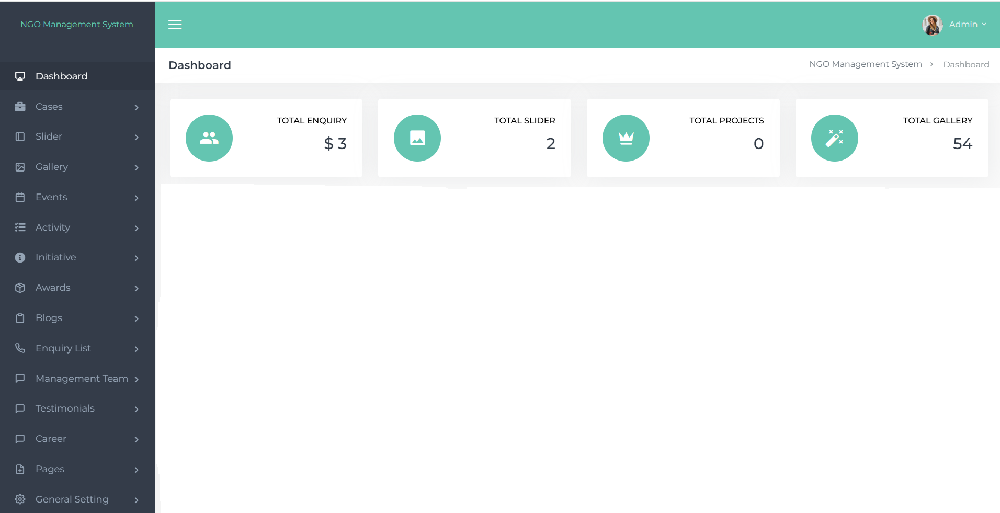

# Dynamic NGO Management Platform

A scalable NGO Management & CMS Platform developed using Laravel and MySQL.

## Features

- Dynamic Page Management
- Dynamic Section Builder
- Certificate Generation
- ID Card Generation
- SEO Management
- Multi Payment Gateway Integration
- Donation Management
- Admin Dashboard
- Dynamic Forms
- REST API Integration
- Generate QR code of the Membership Users
- Download Certificate / ID card in PDF format.

## Tech Stack

- PHP
- Laravel
- MySQL
- Bootstrap
- jQuery
- REST APIs

## Highlights

- Reusable CMS Architecture
- Configurable Payment Gateways
- Dynamic Admin Control System
- Automated Certificate Generation

## Screenshots

### Admin Dashboard

